# 🧧易方达基金 × ima首发基金研选Skill：从获取信息到分析判断，助你走通决策闭环

> 阅读副本；不是原始文件。来源语言和文字保留，未翻译。本次保存图片16/16；未成功下载的引用保留，请核对图片／表格及原始文件。

[原始HTML](raw-source.html) · [提取记录](metadata.json) · [来源网址](https://finance.sina.com.cn/money/fund/jjgsgd/2026-07-24/doc-iniixnhc1584122.shtml)

---

（来源：小易
 易方达基金）

想了解一个投资方向，却不知道从哪开始；想研究一只基金，资料分散在不同地方；持有之后，又很难快速看懂季报、跟踪产品变化。

现在，易方达基金 x ima 知识号上新了！

5个基金研选Skill和3个知识库专区正式亮相。

这是ima平台首个基金公司推出的专业Skill×知识库解决方案。

易方达创新联动skill与知识库，打通从"发现机会"到"判断决策"的完整链路，不仅支持关键信息获取，更要用专业方法论手把手带你实操分析研选，提供覆盖核心决策场景的高效支持。

易方达不只提供好的基金产品，还正在把二十余年投研积淀的专业资管能力，转化为更多投资者可以享受的专业服务能力，通过AI赋能基金投资全旅程。用基金管理人视角的专业内容和工具，陪伴你投资的每一步。

那么这次具体上新了什么？

让我们沿着一只基金从了解、研究到持有的过程来看看吧。

01 先了解方向：从看到热点，到建立知识框架

市场热点和投资概念每天都在变化。很多时候，问题不是看不到信息，而是很难快速抓住重点，也不知道应该从哪些方面继续了解。

这时，可以先从「机会速递专区」开始。

专区会在每个交易日更新市场解读，并根据近期热点调整专题内容，帮助你快速找到值得进一步了解的方向。

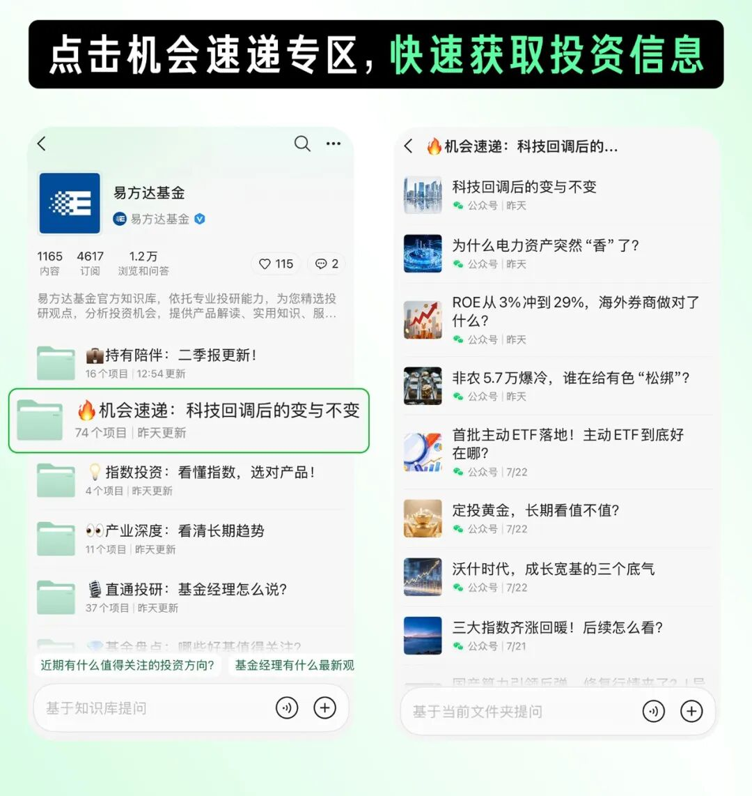

以上图片内容仅为示例，不构成任何投资建议或投资收益保证。

找到感兴趣的方向后，再调用「投教知识导航助手 Skill」，把零散文章整理成更清晰的学习路径。

投教知识导航助手Skill是一个面向投资者的智能知识导航工具，同时适用于没有明确学习方向的初学者，或已有关注主题、希望快速获取系统资料的用户。

它能够围绕投资主题自动整合相关知识内容，梳理知识框架与关联内容，将分散的投教文章转化为体系化的学习资源，帮助投资者从获取信息升级为建立认知，更高效地理解投资知识、形成独立判断。

在copilot中，可以这样问：

• “请调用投教知识导航助手 Skill，帮我梳理半导体。”

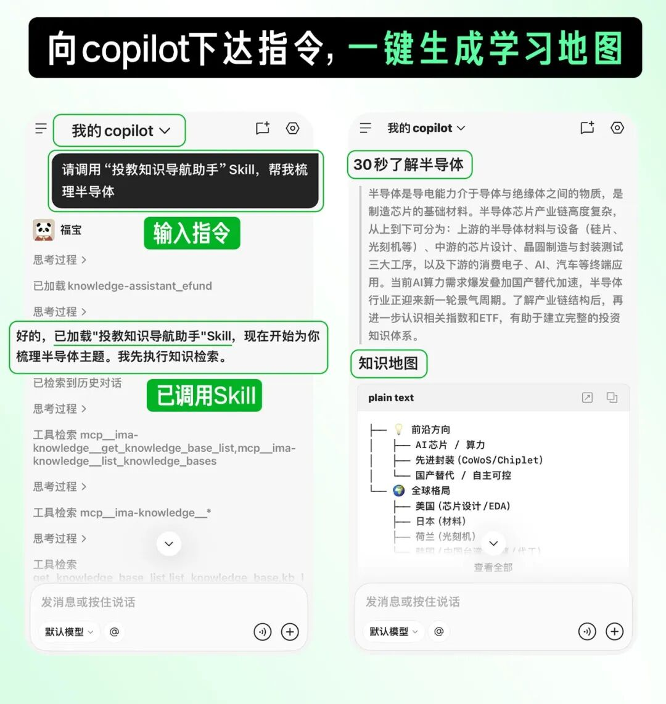

以上图片内容仅为示例，不构成任何投资建议或投资收益保证。

从看到一个热点，到知道应该先了解什么、接着看什么，机会速递专区负责提供入口，投教知识导航助手Skill负责梳理框架。

02 再认识产品：把分散资料放到一起看

了解一个方向之后，还需要进一步认识具体产品。

一只基金的基本信息、持仓情况、基金经理观点和相关解读，往往分散在不同页面。想建立完整视角，需要来回查找和整理。

易方达基金知识号中已有的「基金盘点专区」和「直通投研专区」，汇集近期值得关注的好基和基金经理观点。配合这次上线的「易懂基金 Skill」，手把手带你深入了解具体基金。

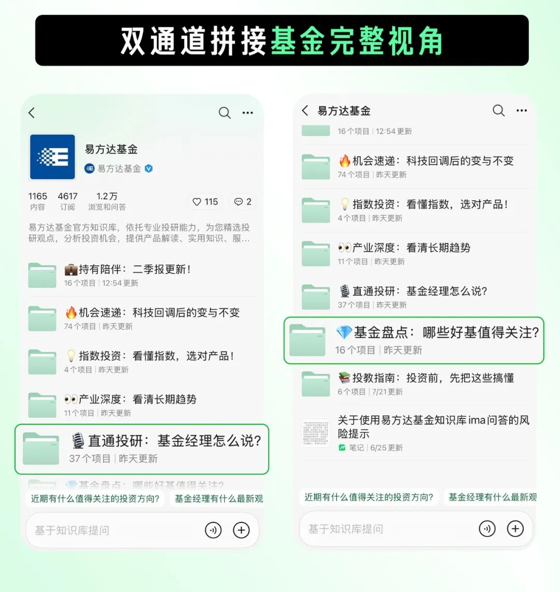

以上图片内容仅为示例，不构成任何投资建议或投资收益保证。

在copilot中，可以这样问：

• “请调用易懂基金Skill，帮我看看510310。”

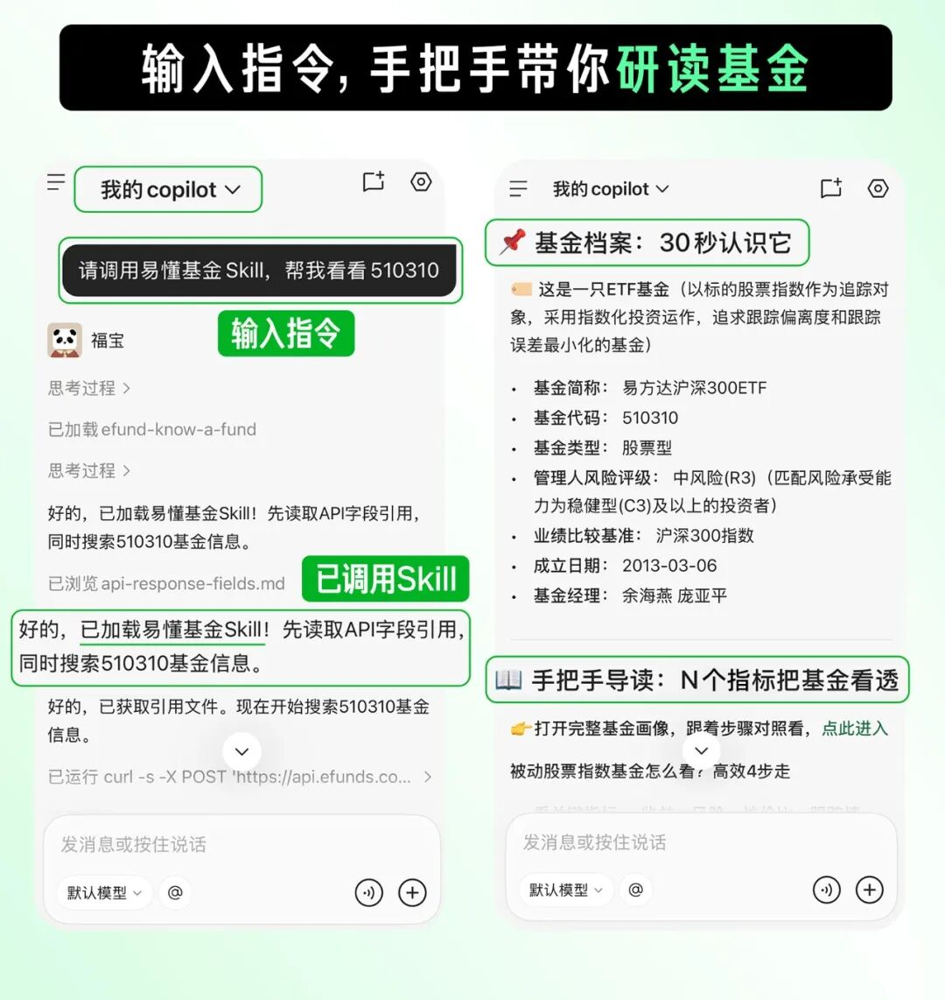

以上图片内容仅为示例，不构成任何投资建议或投资收益保证。

易懂基金Skill会围绕基金特征、解读方法和相关资料生成结构化介绍，并提供进一步探索的入口，你可以点进每个基金专属的基金画像链接去查看丰富信息。

03 持有之后：更快找到季报里的重点

持有基金之后，另一个常见问题是如何持续跟踪产品变化。

季报信息量较大。想了解基金近期的运作情况、重要仓位和相关解读，通常需要花时间翻阅和整理。

新上线的「持有陪伴专区」汇集易方达旗下基金的季报解读、投研观点精华和市场波动分析，帮你快速掌握产品动态。

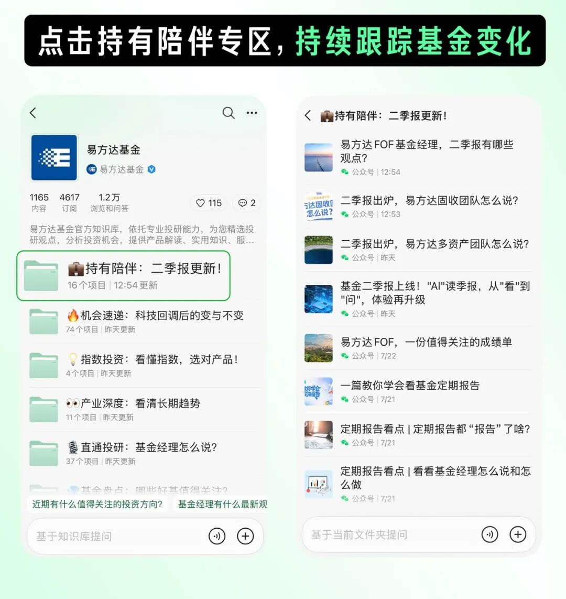

以上图片内容仅为示例，不构成任何投资建议或投资收益保证。

如果想进一步拆解某只基金最新季报的核心变化，可以调用「季报导读 Skill」。

在copilot中，可以这样问：

• “请调用季报导读 Skill，帮我看看159558最新季报。”

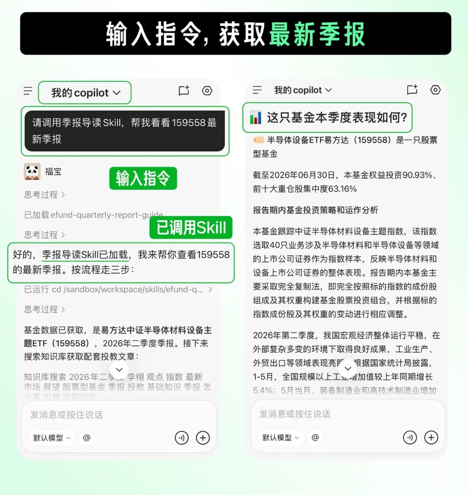

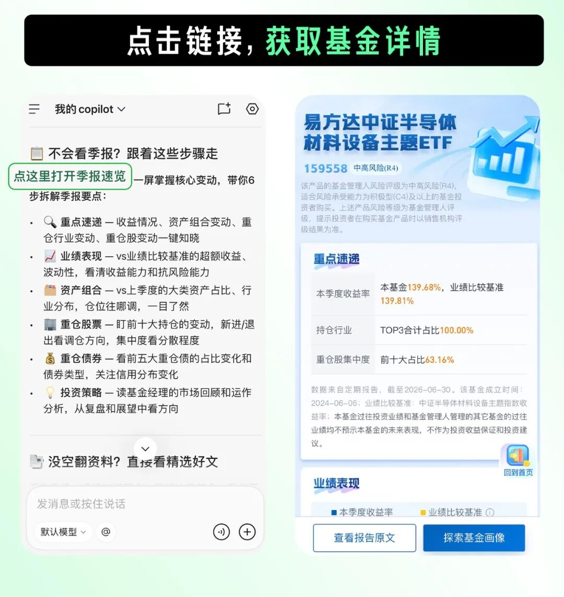

以上图片内容仅为示例，不构成任何投资建议或投资收益保证。

季报导读Skill会整理最新季度的重要仓位及运作分析，并教你如何借助季报速览工具查看资产配置变化。

你还能点进链接，与历史季报做多维对比，帮助你更快找到报告中的重点。

04 指数投资专项：场内外产品信息一键查

如果关注的是指数基金，还会遇到另一类问题。

同一指数往往对应多只 ETF，不同产品在规模、费率和跟踪误差等方面各有差异；如果还想了解场外指数基金，通常又要查询另一组资料。

这次新上线的「指数投资专区」，集中整理指数基金相关的概念科普、交易规则、投资策略和指数辨析，帮助你先建立比较产品的基本框架。

想进一步查询具体数据时，可以使用新上线的「ETF查询Skill」和「场外指数基金查询Skill」。两项技能互补协同，打破场内外数据查询壁垒，提供全覆盖的投研数据服务。

还是以沪深300为例。查询场内外相关产品：

• “请调用ETF查询Skill和场外指数基金查询Skill，帮我查询[沪深300指数](https://finance.sina.com.cn/realstock/company/sh000300/nc.shtml)对应的所有场内ETF和场外指数基金，按规模、费率、跟踪误差做横向对比，并各自生成对比总表”

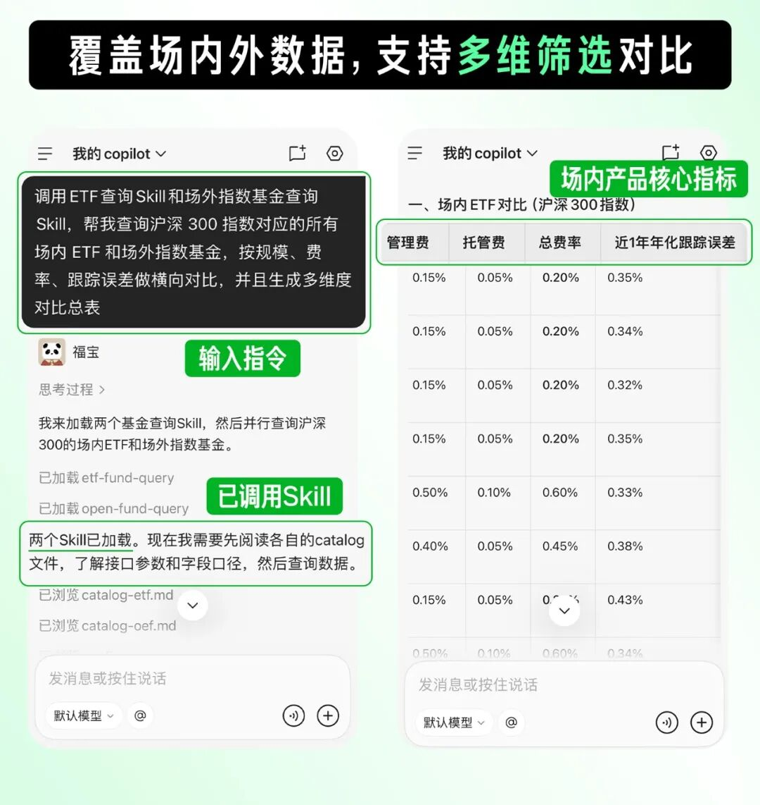

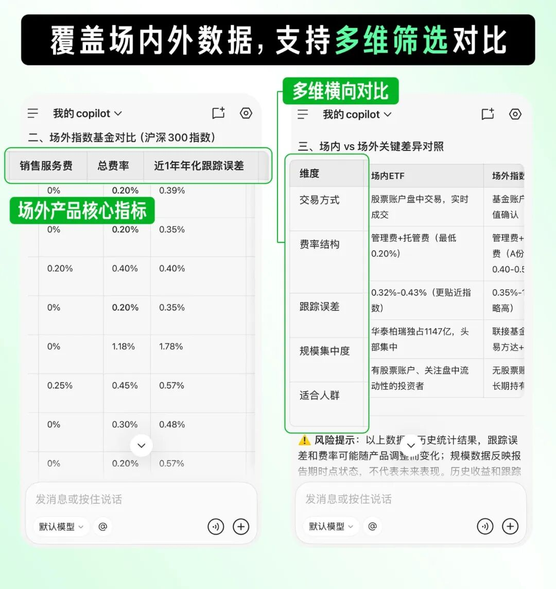

以上图片内容仅为示例，不构成任何投资建议或投资收益保证。

Skill会返回对应产品的核心指标，帮助你在同一类产品中查看差异。如果需要进一步了解某只产品时，还可以继续提问，查询深度数据。

05 怎么安装和使用这些Skill？4步搞定

step 1：订阅知识库

订阅易方达基金知识库，浏览研选资讯

step 2：安装Skill

在APP内打开易方达知识号，切到「Skills」页，一键安装对应Skill

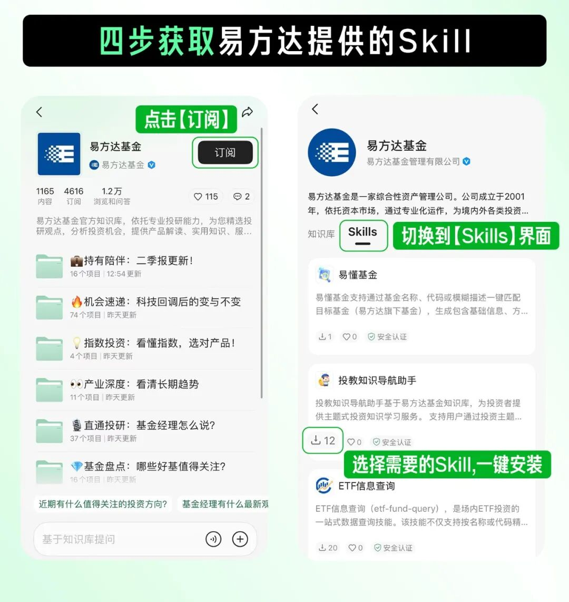

 step 3：领取“ETF查询Skill+场外指数基

 金查询Skill”专属API Key

step 4：打开copilot，填入API Key

首次使用时填入API Key，完成后直接向copilot提问！

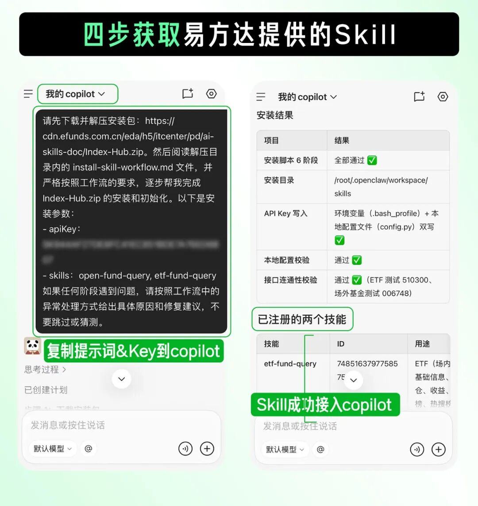

从了解一个方向、认识一只基金，到跟踪季报变化、比较指数基金信息，易方达基金把知识库内容和5个Skill放进了同一套使用路径里。

如果身边也有人正在研究基金，可以把这篇文章转给他，一起试试这些新的内容和工具。

🧧试用有礼

小易也为大家准备了一个惊喜活动！现在跟着上述步骤一键订阅知识库，安装你感兴趣的skill，在你的copilot中尝试调用，挑选你最满意的一个回答，在评论区晒出截图、分享你的使用体验，点赞前100的优质评论有机会获得5元现金红包哟！

下滑查看活动细则与风险提示

活动细则：

(1) 截止时间：2026年8月3日24点

(2) 获奖方式：活动结束后，从留言的公众号粉丝中抽取100位，每位赠送5元惊喜红包好礼。每个用户ID在本次活动中仅限获奖一次。

(3) 开奖方式：2026年8月7日24点前，工作人员将通过后台联系中奖用户。

请您在此期间注意关注微信消息。

(5) 在活动期间若发现任何舞弊或恶意刷奖行为，易方达基金管理有限公司有权取消其活动资格并收回已发放的奖励，同时易方达基金管理有限公司保留必要时追究其法律责任的权利。

(6) 在法律法规许可的范围内，本活动最终解释权归易方达基金所有。本公司可根据活动实际举办情况对活动规则进行变动或调整，相关变动或调整将在活动规则页展示，公布后生效。

风险提示：

基金有风险，投资须谨慎。ima问答内容由AI生成，仅供参考，不构成任何投资建议或投资收益保证。

本资料不构成易方达基金任何宣传推介材料、投资建议或投资收益保证。本资料的观点分析及内容展示不排除信息后续发生任何更新变化，不对该等信息的完整性、及时性作保证。基金有风险，投资须谨慎。投资者不应以该等信息取代其独立判断或仅根据该等信息作出投资决策。请投资者详阅基金法律文件，在全面了解基金产品的风险收益特征、运作特点及销售机构适当性意见的基础上，审慎作出投资决策。

点赞

分享

推荐

[MACD金叉信号形成，这些股涨势不错！](https://finance.sina.cn/app/sfa_macd.shtml?source=pccj)

海量资讯、精准解读，尽在新浪财经APP
