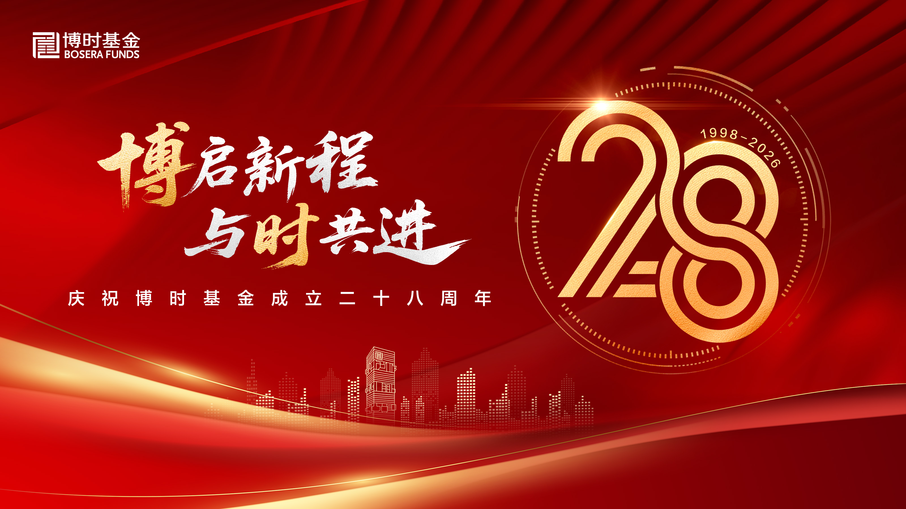

# FUND-211 — 原文 / Original-language source

- 登记标题 / Registered title: 廿八载价值深耕，博时基金奋进高质量发展新征程
- 原始网址 / Original URL: https://www.bosera.com/column/infoDetail.do?classid=00020002000200020003&infoid=2974324
- 获取时间 / Retrieved: 2026-09-07T02:01:48.272505+00:00
- 原始文件 / Downloaded bytes: [source.html](source.html)
- 定位 / Cited locator: 数字金融深度融合 paragraph
- SHA-256: `4915ac4b99178c51fe913a5fb82de2e48aa1b466f5aaf3e46ca656e6412f624b`

> 下文为机械提取的来源原语言文本，未翻译、未改写。版式、图表、脚注及提取缺失以原始文件为准。网页提取可能包含导航或省略动态内容。
> This is an extraction, not a new translation or an assurance that every prior research claim is verified. Original publisher/reprint status is unchanged; human review remains pending.

---

## 廿八载价值深耕，博时基金奋进高质量发展新征程

作者：投资者关系部 时间：2026-07-14 13:24:21

1998年7月13日，伴随中国资本市场发展的时代浪潮，博时基金扬帆起航，成为我国首批五家基金管理公司之一。28载风雨兼程，博时基金不仅是公募基金行业成长的开拓者与见证者，更是中国金融改革深化、服务实体经济壮大的参与者与推动者。

今年是“十五五”开局之年，站在28周年新起点，博时基金锚定“做投资价值的发现者”的初心，践行“为国民创造财富”使命，坚定履行“受人之托、忠人之事”的信义义务，在百年变局中砥砺向前，以高质量发展回应时代之问。

**岁月「鉴初心」**

**廿八载笃行，为投资者创造价值**

从1998年发行国内首只规范运作的封闭式基金——基金裕阳，到如今构建起覆盖权益、固收、指数、另类、海外及养老金投资的全方位资产管理能力，博时基金的成长轨迹，恰是中国资产管理行业从高速发展到高质量发展的缩影。

成立28年以来，博时基金始终坚守“金融为民”底色，将投资者盈利体验作为经营发展的核心标尺，把持有人收益放在首位。截至2026年一季末，公司累计分红逾2286亿元人民币，服务1.8亿客户。2025年，公司为投资者创造基金利润超856亿元，投资者盈利数占比高达96.38%，近三年投资者盈利数占比平均值95.8%，获得感进一步增强，在为民造福的路上笃行致远。

这组沉甸甸的数据，不仅彰显了博时基金卓越的资产管理能力，更印证了其对公募基金信托承诺的坚守。

**深耕「结硕果」**

**结构优化蓄力，筑牢投研护城河**

当下，全球资本市场环境愈发复杂多变，面对白热化的行业竞争和高质量发展转型压力，博时基金提出打造“价值发现为基、投资者利益为本”的行业领先资产管理公司的战略目标，加快向高质量发展模式转型升级，并在多个赛道实现差异化突围，构建了具有韧性的业务版图。

权益投资守正出奇，科创赛道领跑行业。响应监管大力发展权益类基金的号召，博时基金持续完善投研一体化平台建设，加大权益类基金布局。公司敏锐捕捉经济结构转型机遇，在科创投资、指数量化和FOF投资领域精耕细作，为不同风险偏好和配置需求的投资者提供多元产品。截至2026年一季度，博时投向科技创新方向的产品规模近700亿元，成为投资者分享科技红利的重要抓手。

固收业务底蕴深厚，“固收+”转型成效显著。作为业内公认的“固收大厂”，博时基金发挥传统优势，积极向“固收+”战略转型。公司构建了覆盖低波型、平衡型和积极型三大梯度产品的全谱系矩阵，在低利率环境下有效满足了居民稳健理财的替代需求。

ETF及指数业务百花齐放，工具属性日益凸显。伴随ETF迎来发展大时代，博时基金依托“指慧家”品牌积淀，将ETF工具箱打造成引导资源优化配置的关键抓手，特别是在科创赛道形成了极具辨识度的“科创北斗七星”矩阵。截至2026年二季度末，根据相关交易所数据统计，公司旗下非货币ETF规模超2292亿元，在全市场排第7，为投资者提供了高效便利的ETF配置工具。

FOF与资产配置异军突起，一站式解决方案完善。随着投资者稳健投资需求升温，FOF成为投资新宠。依托在大类资产配置领域的长期积累，博时基金自2019年布局FOF业务以来，用七年时间构建起了覆盖3个月、5个月、6个月、1年、3年等不同持有期限的FOF产品矩阵，匹配投资者差异化的流动性需求与资金使用规划，为投资者提供了分散化、专业化的配置解决方案。

**奋进“十五五”**

**服务新质生产力，做实金融“五篇大文章”**

“十五五”规划提出“加快建设金融强国”，公募基金行业肩负着引导社会资金流向实体经济、服务居民财富增值的双重使命。博时基金紧扣时代脉搏，胸怀“国之大者”，扎实做好金融“五篇大文章”，彰显金融央企的责任担当。

科技金融精准滴灌，助力加快形成新质生产力。早在2017年，博时基金便在业内率先组建科创投研一体化小组，首创成长溢价理论，成功破解了不同生命周期科创企业的估值定价难题。近年来，公司联合主流媒体持续开展三季“科创中国·新质生产力调研行”，深入硬科技企业一线，挖掘投资价值。通过持续布局科创系列主题产品，公司引导更多“耐心资本”支持战略性新兴产业，为科技创新注入源源不断的金融“活水”。

绿色金融久久为功，践行可持续发展。作为国内最早加入UN PRI（联合国责任投资原则组织）的机构之一，博时基金将ESG理念深度融入投资全流程。截至2026年一季末，绿色债券投资规模超138亿元。公司连续四年实现运营碳中和，连续三年发布年度ESG报告，坚定不移地走绿色低碳的高质量发展道路。

普惠金融落到实处，坚持让利于民。2023年至今，博时基金已完成逾百只基金的降费让利，切实降低投资者成本。在费率创新方面，2025年公司推出业内首批浮动管理费基金博时卓睿成长股票，探索建立与投资者利益绑定的长效机制。此外，公司积极投身绿色爱心电脑捐赠等公益事业，持续深耕投资者教育与陪伴，以“普及专业知识、守护投资者权益”为己任。

养老金融深耕细作，护航多层次、多支柱养老保险体系。经过二十余年的耕耘，博时基金拥有养老金投资管理全牌照，首批获得全国社保基金、基本养老保险基金及企业/职业年金投资管理人资格。公司一方面做优做强年金投资业绩，另一方面加快发展第三支柱，积极布局个人养老金Y份额及养老FOF产品，构建起三支柱协同发展的博时养老生态圈，助力居民养老资产增值。

数字金融深度融合，加速向智能化跨越。博时基金持续加码金融科技投入，于2023年成立人工智能实验室，2026年4月重磅推出自研企业级智能服务平台——“龙虾平台（BSBox）”，成为金融领域企业级智能体规模化应用的先行者。目前，AI技术已广泛应用于公司投研、营销、风控、运营及研发等全业务环节。

**二十八载新征程，高质量发展再出发**

征程万里风正劲，奋楫扬帆再出发。

面向“十五五”，博时基金将以打造“价值发现为基、投资者利益为本”的行业领先资产管理公司为战略目标，努力成为客户价值的创造者、投资价值的发现者、高质量发展的引领者和金融强国的建设者。公司将以“1+2+1”战略为总引擎，擘画高质量发展新图景——筑牢“一个文化”根基，深植“五要五不”的中国特色金融文化；锻造“两种能力”，即资产投资能力与配置能力，以专业创造价值；建强“一个平台”，以考核为抓手、以基准为核心、通过平台化建设赋能，加快投研一体建设，予以全面平台赋能。

长风破浪会有时，直挂云帆济沧海。展望未来，博时基金将继续秉持初心，服务中国资本市场健康发展，为投资者创造更多价值，为招商局集团“第三次创业”和金融强国建设贡献博时力量。

风险提示：本材料所载信息不构成对买卖任何证券或提供任何投资决策建议的服务。该等信息在任何时候均不构成对任何人的具有针对性的、指导具体投资的操作意见，投资者应当对本材料的信息进行评估，根据自身情况自主做出决策并自行承担风险。我们对所载材料的准确性、可靠性、时效性及完整性不作任何明示或暗示的保证。本材料所载内容仅为该资料出具日的信息，后续可能发生变更。未经授权禁止第三方机构或个人以任何形式进行商业用途的传播、剪辑。
