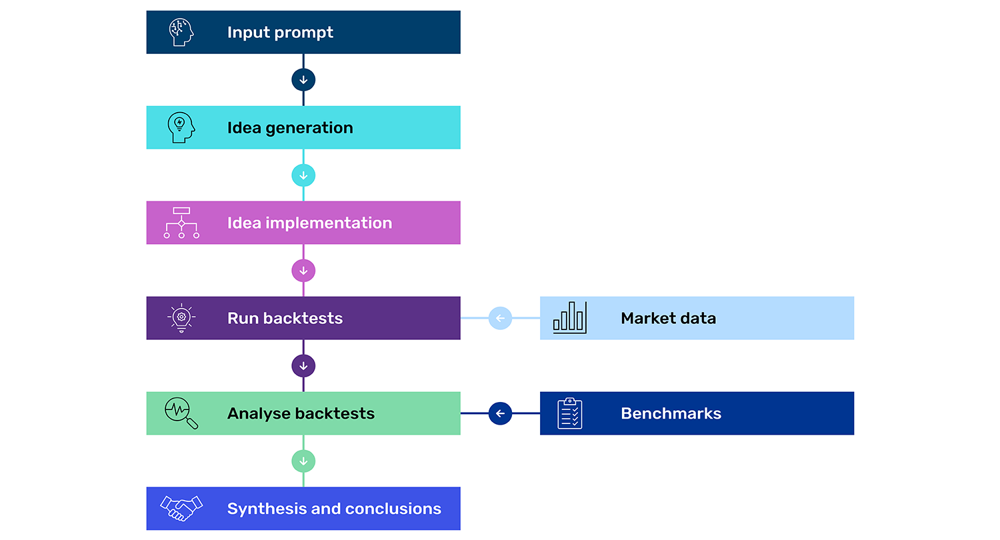

# A Trend Following Deep Dive: AlphaTrend and Agentic Research Workflows

> 来源原语言正文提取；发布时间：2026-02-11。[原始HTML](source.html) · [元数据](metadata.json)。提取不升级独立效果或部署核验。

## Introduction

In [Part One](https://www.man.com/insights/ai-agents-trend) of this series, we introduced the Alpha Assistant, an agentic AI system designed to accelerate quantitative research by bridging the gap between generic large language model (LLM) responses and a fully integrated output, actionable within the firm’s proprietary research environment. While powerful, we highlighted that the Alpha Assistant faces limitations inherent to current LLM architectures: LLMs can only pay attention to so much information in their context and can only work on tasks for so long before exhausting their available attention span. This left us with a key question: is there a better approach to overcome current model limitations?

In Part Two, we argue that the answer lies in specialisation. Rather than building a single, maximally flexible assistant, we can construct purpose-built agentic workflows optimised for particular research tasks. Enter AlphaTrend: a specialised agentic system designed for a specific area of trend-following signal research. Where the Alpha Assistant serves as an interactive coding partner, AlphaTrend functions as a predefined and structured autonomous research pipeline, systematically generating, implementing and researching signal proposals through a pre-defined workflow.

In what follows, we explore AlphaTrend's architecture, demonstrate its capabilities with a practical example, and share what we’ve learned from deploying specialised agentic workflows in quantitative research.

## The trade-off: flexibility versus depth

To understand why specialisation matters, we must first emphasise a fundamental constraint: the design of any agentic AI system involves a trade-off between flexibility and depth. The Alpha Assistant leans heavily towards flexibility, maintaining broad scope across the research lifecycle, handling diverse analytical tasks and requiring researcher input at each step. This interactive approach enables one-off analyses that don't fit predefined patterns, though at a cost of limiting the analytical depth of responses. AlphaTrend makes the inverse choice, focusing on a specific area of trend-following signal research. As we will show, it is optimised for depth rather than breadth.

## AlphaTrend: architecture and design philosophy

How does it work? At its core, AlphaTrend consists of different stages or “nodes”, each representing a specific operation in the research workflow.

### Figure 1: A modular and configurable pre-defined workflow

Source: Man Group. Schematic illustration.

Unlike the Alpha Assistant's conversational, iterative approach, AlphaTrend's structure – the sequence of operations, their dependencies, and information flow between stages – is specified before execution begins. This provides several advantages, namely ensuring the process is transparent, that it can be reproduced and is auditable. Further, independent nodes can execute concurrently, allowing AlphaTrend to query the LLM numerous times simultaneously. By querying the same system multiple times, AlphaTrend leverages the inherent stochastic nature of the LLM to generate diverse signal proposals.

This parallel querying serves multiple purposes. First, it gives rise to creativity 1 as different queries produce different outputs, exploring variations within the same conceptual framework. Second, it enables consistency checking, making it easier to spot hallucinations. If the LLM produces contradictory proposals between queries, that signals unreliable reasoning. Even when implementing a fundamentally sound idea, individual queries can contain errors that would lead to incorrect conclusions if executed only once. Multiple queries thus offer both diversity and validation. Rather than attempting all reasoning in a single LLM call – constrained by limited attention span – complex analysis breaks into multiple focused stages, each with its own context and objectives. Later stages can access outputs and reasoning from earlier stages, enabling progressive refinement while maintaining consistency across the workflow.

## Three experiments: the good, the bad and the broad

We tested AlphaTrend with three categories of ideas: good ideas (where we know the answer should be positive), bad ideas (where we expect negative results), and broad ideas (where the outcome is genuinely uncertain). Our benchmark is a simplified variant of an existing breakout signal. This variant excludes a critical modification that enhances the system’s responsiveness. By removing this component from the benchmark, we establish a deliberate gap – a known opportunity for improvement – that allows us to test whether AlphaTrend can rediscover it.

### The good: rediscovering reactivity

For our first experiment, we describe the excluded reactivity mechanism to AlphaTrend. This serves as a validation test: if AlphaTrend is functioning properly, it should identify this idea as a genuine improvement.

The system generates multiple proposals that implement variations of the reactivity mechanism, each exploring slightly different parameter choices and implementation details. After validation, backtesting and synthesis of all empirical evidence, ideas, correlations etc., AlphaTrend reaches a clear conclusion: these proposals consistently outperform the benchmark.

The Sharpe ratio distribution illustrates this visually (Figure 2). While the benchmark sits at approximately 0.95, the proposed ideas cluster around 1.05, with the majority of implementations showing clear improvement. The cumulative return curves reinforce this finding: the blue fan of proposal returns consistently exceeds the navy blue benchmark line, particularly in the later years of the sample period.

### Figure 2: Good idea Sharpe ratio distribution and cumulative sim return

Returns are not compounded, and so a straight line corresponds to constant performance over time.

Problems loading this infographic? - [Please click here](https://public.flourish.studio/visualisation/26871960/)

Source: Man AHL, as of 31 December 2015. Data is for illustrative purposes only and does not represent actual performance of a product or strategy.

### The bad: putting the system on a sub-ideal track

For our second set of experiments, we provide AlphaTrend with ideas that we expect to underperform the benchmark, as shown in the prompt below. These aren't necessarily "silly" ideas. Rather, they represent reasonable hypotheses that simply happen to be inferior to the benchmark approach, such as using pivot points, and other variations on breakout detection.

“Create a signal based on pivot points. The basic idea is that a "peak" pivot point is defined as a price point that is surrounded by N days’ worth of prices that are lower than it, so it can clearly be seen and defined as a "local peak", and vice versa for a "trough" pivot point. You need to think very carefully through the logic of the pivot point identification logic to make it robust to all kinds of price trajectories and patterns.”

The results demonstrate that AlphaTrend does not produce uniformly positive conclusions. The Sharpe ratio distribution is centred well below the benchmark at approximately 0.80, with virtually all proposals underperforming (Figure 3).

### Figure 3: Bad idea Sharpe ratio distribution and cumulative sim return

Returns are not compounded, and so a straight line corresponds to constant performance over time.

Problems loading this infographic? - [Please click here](https://public.flourish.studio/visualisation/26873738/)

Source: Man AHL, as of 31 December 2015. Data is for illustrative purposes only and does not represent actual performance of a product or strategy.

These results are crucial for validating AlphaTrend's utility. A system that only produced positive results would be useless. We need to know when ideas don't work. Indeed, this behaviour mirrors real research experience: our benchmark is difficult to beat, and many alternative approaches fail to improve upon it.

### The broad: exploring uncertain territory

The results for broad ideas differ from both clearly good and bad ideas. The Sharpe ratios range from 0.70 to 1.00 and centre around 0.85 (Figure 4). Some proposals outperform the benchmark during certain periods (particularly 2012-2016) while underperforming in others (2000-2008). This regime-dependent behaviour suggests the underlying concept captures something real but context-specific rather than universally applicable. AlphaTrend’s full output provides evidence and guidance on which signal ideas drive these varying outcomes.

### Figure 4: Broad idea Sharpe ratio distribution and cumulative Sim return

Returns are not compounded, and so a straight line corresponds to constant performance over time.

Problems loading this infographic? - [Please click here](https://public.flourish.studio/visualisation/26874087/)

Source: Man AHL, as of 31 December 2015. Data is for illustrative purposes only and does not represent actual performance of a product or strategy.

## Lessons for research practice

These validation experiments demonstrate that AlphaTrend delivers reliable judgements: promising ideas are recognised as good, weak ideas as bad, and broad ideas receive nuanced analysis, supported by metrics that extend beyond Sharpe ratios and account curves. Variation within experiments is not just noise but proves informative, revealing which implementation details are critical, which parameter choices perform best, and which variants warrant further investigation. Perhaps most valuably, the system rapidly identifies and eliminates unproductive research paths early, enabling researchers to redirect effort to more promising avenues. These experiments also underscore the importance of human judgment in building and calibrating the agentic system. AlphaTrend's output quality also depends critically on how researchers frame questions and interpret results, while multiple testing presents a risk which demands rigorous statistical standards and appropriate scepticism to avoid spurious findings. In short, AlphaTrend can accelerate and systematise the research process, but human creative thinking, disciplined evaluation and a robust research process remain vital elements of a successful research programme.

## Model character and personalities: an additional consideration

Researchers must consider one more factor when deploying AlphaTrend or similar agentic AI approaches: the character and personality of the underlying LLM. Different models exhibit distinct creative and reasoning tendencies when given identical starting points, and these differences can meaningfully affect research outcomes. This isn’t about which model is objectively better, but rather about understanding each model's characteristic behaviour and matching it to the task at hand.

To illustrate this, we ran the same broad idea experiment using two different models: Claude (Anthropic's Claude 4.0 Sonnet) and GPT (OpenAI's GPT-5). The correlation matrices and dendrograms reveal striking differences in creative approach (Figure 5). Claude's proposals show high correlation across the board, with most pairwise correlations above 0.85 and a dendrogram that clusters tightly except for a few distinct outliers.

### Figure 5: Claude Sims sorted correlation matrix and dendrogram

Problems loading this infographic? - [Please click here](https://public.flourish.studio/visualisation/26875186/)

Source: Man AHL. Data provided for illustrative purposes only.

GPT's proposals, by contrast, show substantially more diversity. The correlation matrix displays a richer structure with correlations ranging from 0.75 to 1.0 and distinct blocks of high correlation separated by regions of lower correlation (Figure 6). The dendrogram reveals multiple clusters at meaningful distance thresholds, indicating that GPT-5 generated several conceptually distinct approaches to the same broad idea. Where Claude converged on a single interpretation, highly correlated to the benchmark, GPT-5 explored multiple differentiating interpretations in parallel.

### Figure 6: GPT Sims sorted correlation matrix and dendrogram

Problems loading this infographic? - [Please click here](https://public.flourish.studio/visualisation/26874589/)

Source: Man AHL. Data provided for illustrative purposes only.

While GPT-5’s behaviour in this example shows a “creative” range of signals, other LLMs might exhibit more desirable characteristics, depending on the context, stage or research objective. This model-dependent creativity adds another dimension to the researcher's toolkit, but also another consideration in workflow design. Just as researchers must carefully craft prompts and validation criteria, they must thoughtfully select which model to deploy for each research question.

## Conclusion: The spectrum of agentic research

The Alpha Assistant and AlphaTrend represent two fundamentally different approaches to agentic AI in quantitative research. The Alpha Assistant is broad, interactive and flexible, serving as a coding partner across the full research lifecycle where the researcher maintains control at each step. Optimised for exploratory analysis and diverse tasks, it trades depth for breadth. AlphaTrend is narrow, automated and specialised, functioning as an autonomous research pipeline for specific domains that executes multi-stage workflows with minimal intervention. Optimised for systematic exploration and deep analysis, it trades flexibility for focus.

Neither approach is universally superior. They are complementary tools suited to different research challenges. Current LLM limitations force us to make a choice. However, as models become more capable, we may see the two methodologies converge.

1\. The level of creativity is a function of the given prompt. The more open-ended the question, the more you leverage the creativity of the LLM, and the more careful you need to be about overfitting. If, instead, you pass in a very specific idea and rely on the “creativity” of the LLM more to check for robustness to different signal constructions, then overfitting risk is less, and indeed some diversity in signal construction is a good thing for robustness checking.

*This paper was authored by Martin Luk (Senior Quant Researcher, Man AHL), Tarek Abou Zeid (Partner and Head of Client Portfolio Management, Man AHL), and Otto van Hemert (Senior Advisor, Man Group).*

For further clarification on the terms which appear here, please visit our [Glossary page](https://www.man.com/glossary).

### Trend Following

This information is communicated and/or distributed by the relevant Man entity identified below (collectively the "Company") subject to the following conditions and restriction in their respective jurisdictions.

Opinions expressed are those of the author and may not be shared by all personnel of Man Group plc (‘Man’). These opinions are subject to change without notice, are for information purposes only and do not constitute an offer or invitation to make an investment in any financial instrument or in any product to which the Company and/or its affiliates provides investment advisory or any other financial services. Any organisations, financial instrument or products described in this material are mentioned for reference purposes only which should not be considered a recommendation for their purchase or sale. Neither the Company nor the authors shall be liable to any person for any action taken on the basis of the information provided. Some statements contained in this material concerning goals, strategies, outlook or other non-historical matters may be forward-looking statements and are based on current indicators and expectations. These forward-looking statements speak only as of the date on which they are made, and the Company undertakes no obligation to update or revise any forward-looking statements. These forward-looking statements are subject to risks and uncertainties that may cause actual results to differ materially from those contained in the statements. The Company and/or its affiliates may or may not have a position in any financial instrument mentioned and may or may not be actively trading in any such securities. Unless stated otherwise all information is provided by the Company. Past performance is not indicative of future results. The value of an investment and any income derived from it can go down as well as up and investors may not get back their original amount invested. Alternative investments can involve significant additional risks.

Unless stated otherwise this information is communicated by the relevant entity listed below.

**Australia:** To the extent this material is distributed in Australia it is communicated by Man Investments Australia Limited ABN 47 002 747 480 AFSL 240581, which is regulated by the Australian Securities & Investments Commission ('ASIC'). This information has been prepared without taking into account anyone’s objectives, financial situation or needs.

**Austria/Germany/Liechtenstein:** To the extent this material is distributed in Austria, Germany and/or Liechtenstein it is communicated by Man (Europe) AG, which is authorised and regulated by the Liechtenstein Financial Market Authority (FMA). Man (Europe) AG is registered in the Principality of Liechtenstein no. FL-0002.420.371-2. Man (Europe) AG is an associated participant in the investor compensation scheme, which is operated by the Deposit Guarantee and Investor Compensation Foundation PCC (FL-0002.039.614-1) and corresponds with EU law. Further information is available on the Foundation's website under [www.eas-liechtenstein.li](https://www.eas-liechtenstein.li/).

**European Economic Area:** Unless indicated otherwise this material is communicated in the European Economic Area by Man Asset Management (Ireland) Limited (‘MAMIL’) which is registered in Ireland under company number 250493 and has its registered office at 70 Sir John Rogerson's Quay, Grand Canal Dock, Dublin 2, Ireland. MAMIL is authorised and regulated by the Central Bank of Ireland under number C22513.

**Hong Kong SAR:** To the extent this material is distributed in Hong Kong SAR, this material is communicated by Man Investments (Hong Kong) Limited and has not been reviewed by the Securities and Futures Commission in Hong Kong.

**Japan:** To the extent this material is distributed in Japan it is communicated by Man Group Japan Limited, Financial Instruments Business Operator, Director of Kanto Local Finance Bureau (FIBO) No. 624 or other licensed financial instruments business operators for the purpose of providing information on investment strategies, discretionary investment management, and other investment services, etc. provided by Man Group, and is not a disclosure document stipulated by laws and regulations. This material can be communicated only to professional investors or institutional investors, intermediaries, gatekeepers, or consultants who may have sufficient knowledge and experience of related risks.

**Switzerland:** To the extent this material is made available in Switzerland the communicating entity is Man Investments AG, Huobstrasse 3, 8808 Pfäffikon SZ, Switzerland, which is regulated by the Swiss Financial Market Supervisory Authority (‘FINMA’).

This material is proprietary information and may not be reproduced or otherwise disseminated in whole or in part without prior written consent. Any data services and information available from public sources used in the creation of this material are believed to be reliable. However accuracy is not warranted or guaranteed. © Man 2026